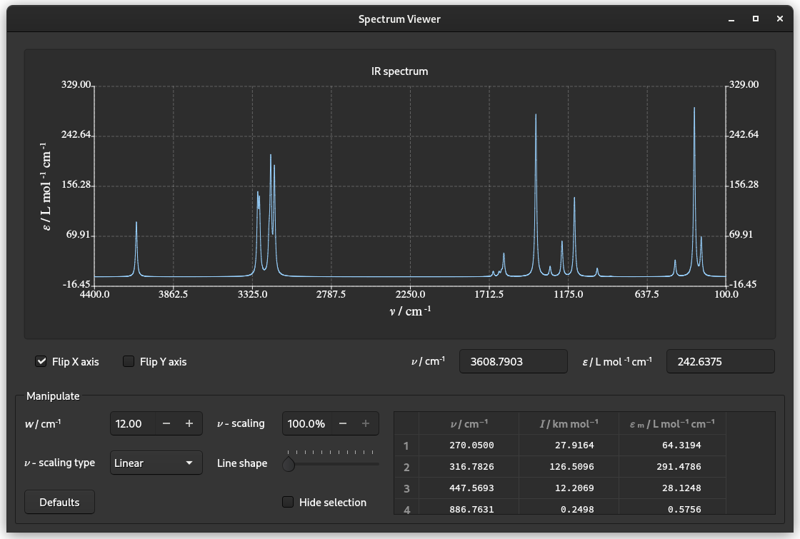

## QMolView
QMolView is an application for viewing molecular xyz, cml  and Molden Normal Mode files. Supported platforms are Linux and Windows 10 or later. Example files are included in the extras folder.  Molden Normal Mode files can be generated with PSI4 https://psicode.org/ and hfscf https://github.com/AlexB67/hfscf.

Consult the manual in the extras/doc folder for more details.




## Installation
Ready made installers for windows and Linux flatpak will be available soon. For now the only option is to build from source.

### Building the software
#### Linux
The following packages are required:
* cmake
* Qt 5.15 or greater, but less than 6.0.0.
* The following Qt5 components
  * 3DExtras 
  * 3DRender 
  * 3DCore 
  * Widgets
  * Charts
* GNU C++ compiler Supporting the C++17 standard.
* Git, to clone the repository.

Install the above packages. To compile and build the application issue the commands:
```
git clone https://github.com/AlexB67/QMolview.git
cd qmolview
mkdir build
cd build
cmake ..
make -j
```
Out of source tree builds work also if preferred.
#### Windows
Perform a Qt installation using the Qt installer at https://www.qt.io/download

Install the MinGW compiler and the following components:
* Qt 5.15 or greater, but less than 6.0.0.
* The following Qt5 components
  * Qt3D
  * Widgets
  * Charts
  * Development tools Qt Creator

Use git to clone the repository or download the source tarball. The source code can then be imported as a CMake project in Qt Creator or vscode, or any IDE of your choice with CMake support.

Perform a build from within Qt Creator. 

Consult the Qt website how to deploy a standalone application using **windeployqt**. 

### Installation
#### Linux
Installations is not required. You can run the application directly from the build directory with the cammand
```
cd to_build_dir # path to your build directory
src/qmolview
```
Should you wish to install the application run the commands
```
cd to_build_dir # path to your build directory
sudo make install
```
The application can then be found in the Application list as "QMolView".
### Uninstall
#### Linux
To remove  the application run the commands
```
cd to_build_dir # path to your build directory
sudo xargs rm < install_manifest.txt
```
