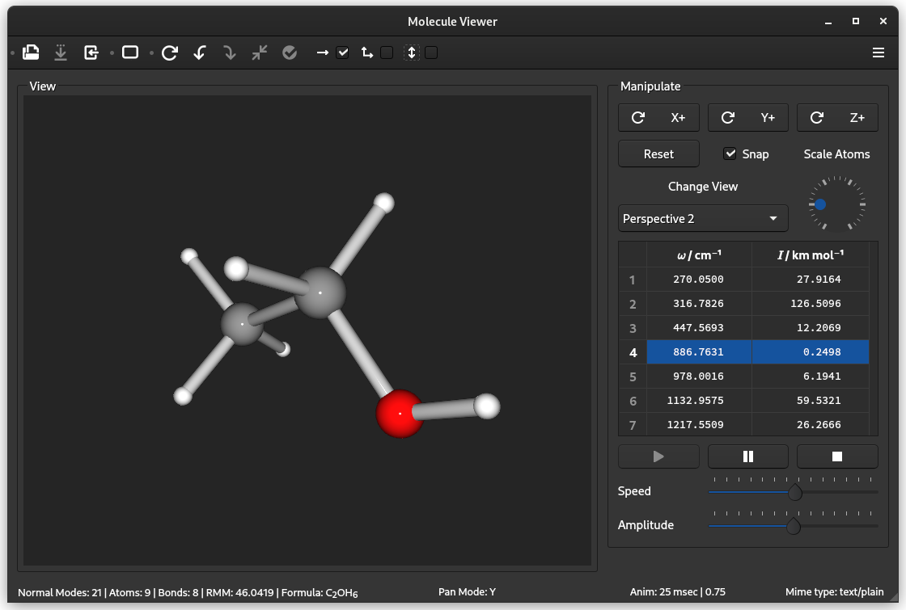

## QMolView
QMolView is an application for viewing molecular xyz and Molden Normal Mode files. Supported platforms are Linux and Windows 10 or later.



### Building the software
The following packages are required:
* cmake
* Qt 5.12 or greater.
* The following Qt5 components
  * 3DExtras 
  * 3DRender 
  * 3DCore 
  * Widgets
* GNU C++ compiler Supporting the C++17 standard.
* Git, to clone the repository.

Install the above packages. To compile and build the application issue the commands:
```
cd qmolview
mkdir build
cd build
cmake ..
make -j
```

### Installation
Installations is not required. You can run the application directly from the build directory with the cammand
```
cd to_build_dir # path to your build directory
src/qmolview
```
Should you nevertheless wish to install the application run the commands
```
cd to_build_dir # path to your build directory
sudo make install
```
The application can then be found in the Application list as "MolView".
### Uninstall
To remove  the application run the commands
```
cd to_build_dir # path to your build directory
xargs rm < install_manifest.txt
```
